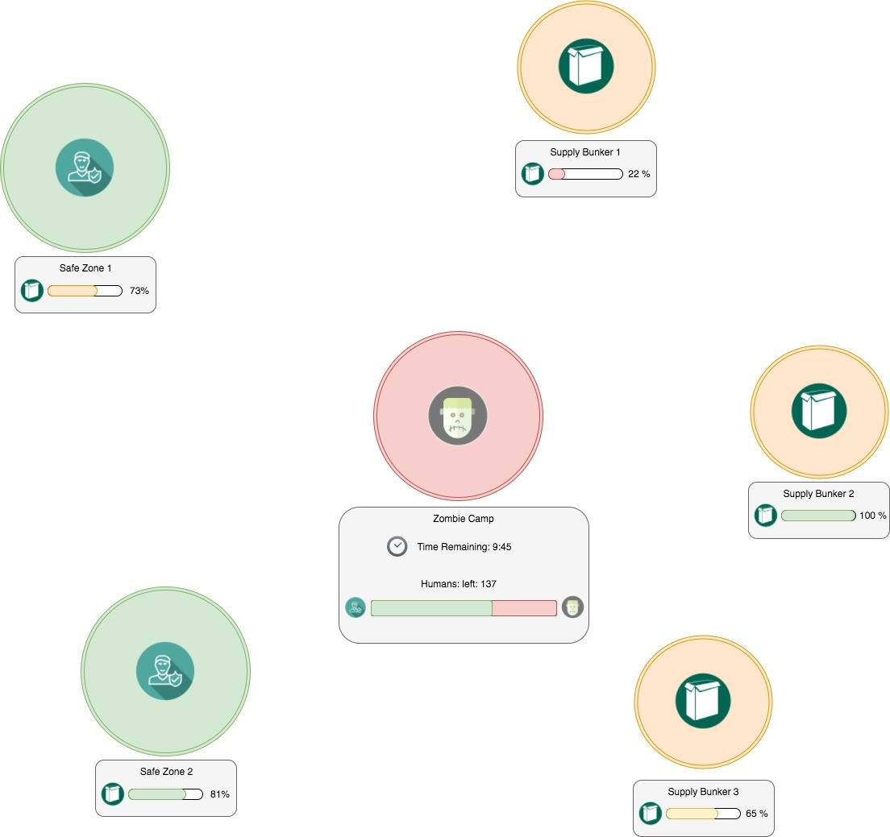

# Real-Life-Game : Humans vs Zombies

Ce projet regroupe le gameplay, les sources, et les ressources nécessaires pour le jeu grandeur nature Humans vs Zombies.

## Introduction

### Scenario
Les zombies ont envahi la planète. Il ne reste que quelques centaines d’humains et une poignée de zones protégées. Malheureusement, la nourriture se fait rare et les humains vont devoir en sortir pour aller se ravitailler. Arriveront-ils à survivre aux zombies?

### But du jeu
 * Les **zombies** gagnent la partie si ils arrivent à contaminer l’ensemble des humains, ou si les humains ont perdu toutes leurs safe zones.  
 * Les **humains** gagnent la partie si ils ont au moins une safe zone et encore un humain à la fin du temps réglementaire.

## Paramètres de jeu (variables)

Temps de jeu en minutes
Nombre d’humains (<=> nombre de Human Life Tags)
Quantité de vivres en kg
Vitesse de chute des vivres en kg/min
Quantité de vivres dans chaque SupplyBunker en kg

## Primitives du jeu

### Human Life Tag
`Une carte plastique représentant la vie d’un humain.`   
Un joueur est « vivant » lorsqu’il quitte la safe zone avec un HumanLife Tag dans sa poche.
Si il est touché par un Zombie, il lui donne son tag et doit retourner en prendre un autre dans la SafeZone de son choix. Le Zombie doit alors ramener le tag dans son camp afin que la mort de l’humain soit comptabilisée par la ZombieBeacon.

### Safe Zone
`Une zone où les zombies ne peuvent pas attaquer.`  
Elle est active tant que le niveau de nourriture de la SafeZoneBeacon est > 0.
Le niveau de nourriture de la save zone chute avec le temps. Il faut donc que les humains aillent ravitailler leur safe zone pour ne pas la perdre. Pour cela, ils vont devoir aller en chercher dans un des Supply Bunkers.

### Supply Bunker
`Une zone qui contient une certaine quantité de nourriture.`  
Quand un humain vient prendre de la nourriture, il place son tag NFC au niveau de la SupplyBeacon. La balise va lentement charger le tag (30s pour faire le plein) de nourriture, qu’il pourra ensuite décharger à son camp sur la SafeZoneBeacon.

### Zombie Camp
`La zone réservée aux Zombies.`  
Le camp de zombies contient la ZombieBeacon, qui est au courant du nombre d’humains qui ont été infectés. Chaque fois qu’un zombie prend le tag d’un humain, il doit aller l’enregistrer à la ZombieBeacon pour être comptabilisé.

### Objets connectés

Le jeu fonctionne avec trois balises dont les spécifications fonctionnelles sont décrites ci-dessous.

#### SafeZoneBeacon
Cette balise contient une jauge du niveau de nourriture restant (en %), ainsi qu’un gyrophare de couleur verte si elle est active, éteint quand elle est asséchée.
Elle contient un récepteur NFC permettant de lire un tag et de collecter la nourriture récupérée par le joueur.
Elle contient aussi une jauge du niveau de déchargement progressif du tag (prend 30s à décharger complètement)
Elle contient aussi un bouton permettant de compter et d’incrémenter chaque « spawn »
Enfin, elle contient un haut-parleur permettant de notifier du début et de la fin du jeu.

#### SupplyBeacon
Cette balise contient une jauge du niveau de nourriture restant (en %), ainsi qu’un gyrophare de couleur jaune si elle est active, éteint quand elle est asséchée.
Elle contient un récepteur NFC permettant de lire un tag et de collecter de la nourriture depuis sa réserve pour le joueur.
Elle contient aussi une jauge du niveau de chargement progressif du tag (prend 30s à charger complètement)
Enfin, elle contient un haut-parleur permettant de notifier du début et de la fin du jeu.

#### ZombieBeacon
Cette balise contient une jauge de la quantité restante d’humains (en %), ainsi qu’un gyrophare de couleur rouge.
Cette balise contient un récepteur NFC permettant de lire un tag et compter la « contamination » d’un humain. Ceci décrémente le nombre d’humains restant en jeu.
Enfin, elle contient un haut-parleur permettant de notifier du début et de la fin du jeu.

Ces trois balises peuvent donc toutes avoir le même hardware, avec un sélecteur en début de jeu.

### Companion apps

Le jeu fonctionne avec un certain nombre d'applications permettant à la fois de configurer le jeu et de donner des informations temps-réel sur son déroulement.

#### Real-Life-Game Human vs Zombies
Cette webapp permet de:
 * configurer les paramètres de jeu et lancer un round de Human vs Zombies
 * voir un dashboard temps réel du score et des différentes ressources restantes (Etat des Safe Zones, Quantité de nourriture restante dans les bunkers, Nombre d'humains restant, Position des joueurs, Temps de jeu restant)

### Real-Life-Game Human vs Zombies Companion
Cette application mobile permet aux joueurs d'avoir un certain nombre d'informations in-game (comme le dashboard, mais personnalisé selon le camp du joueur)
